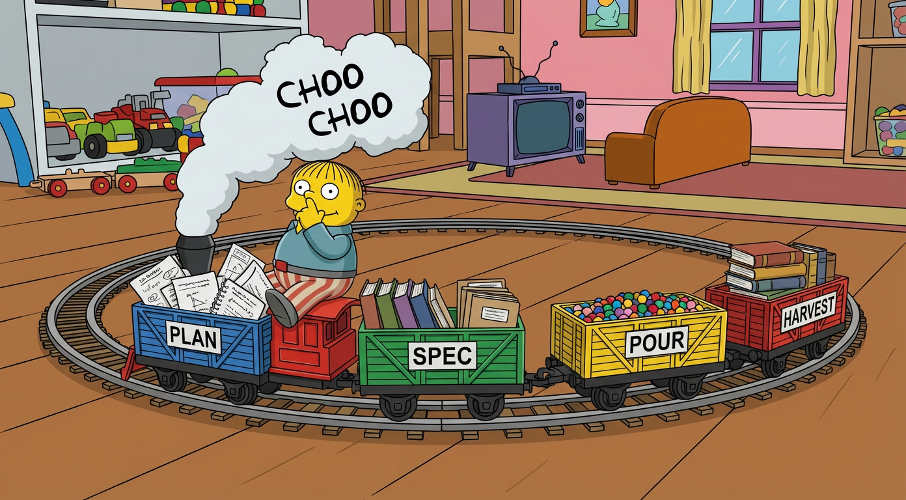

# Choo Choo Ralph

<p align="center">
  
</p>


<p align="center">
  <a href="#quick-start">Quick Start</a> •
  <a href="#what-you-get">What You Get</a> •
  <a href="#why-beads">Why Beads</a> •
  <a href="#documentation">Documentation</a>
</p>

<p align="center"><em>Relentless like a train. Persistent like Ralph Wiggum. Ships code while you sleep.</em></p>

> **🧪 Experimental** — This workflow is actively tested on real projects. Smaller, verified tasks trade higher Claude Code usage for more reliable outcomes. Your mileage may vary—I'd love feedback on what works and what doesn't.

---

## What is Choo Choo Ralph?

A [Claude Code](https://claude.com/claude-code) plugin that turns your plans into autonomous, verified work—designed for teams, not just side projects.

Most Ralph implementations use GitHub Issues (latency), scattered markdown files (messy), or monolithic JSON (doesn't scale). Choo Choo Ralph uses [Beads](https://github.com/steveyegge/beads)—a git-native task tracker where every task has an ID, workflows have real dependencies, and everything syncs through git the way your team already works.

**The thesis**: Simple loop + structured workflows + persistent memory = autonomous coding that actually works.

---

## The Workflow

```
┌─────────────┐     ┌─────────────┐     ┌─────────────┐     ┌─────────────┐     ┌─────────────┐
│   1. Plan   │ ──▶ │  2. Spec    │ ──▶ │  3. Pour    │ ──▶ │  4. Ralph   │ ──▶ │ 5. Harvest  │
│    (you)    │     │  (you + AI) │     │    (AI)     │     │    (AI)     │     │ (you + AI)  │
└─────────────┘     └─────────────┘     └─────────────┘     └─────────────┘     └─────────────┘
```

1. **Plan** — Write what you want to build (this part is yours)
2. **Spec** — AI transforms it into structured tasks; you review
3. **Pour** — Tasks become beads with workflows and dependencies
4. **Ralph** — The loop runs autonomously until done
5. **Harvest** — Extract learnings into skills, docs, or CLAUDE.md

---

## What You Get

- **Verified, not vibes** — Health checks before implementing, tests after, browser verification when needed
- **Team-friendly** — Git-native sync, no API latency, works with how your team already collaborates
- **Traceable** — Bead IDs link commits to tasks, learnings to work. Full history of what happened where.
- **Structured phases** — Bearings → Implement → Verify → Commit (not just "do the thing")
- **Bounded context** — Each task carries its own history via [Beads](https://github.com/steveyegge/beads), no context window bloat
- **Compounding knowledge** — Agents capture learnings as they work; harvest them into skills and docs that make future sessions smarter
- **Customizable workflows** — Formulas and scripts are yours to modify, not hardcoded decisions

---

## Quick Start

<details>
<summary>⚠️ <strong>Safety Warning</strong> — Read before running</summary>

Ralph runs Claude with `--dangerously-skip-permissions`, which allows it to execute commands without confirmation. This is powerful but risky.

**We strongly recommend:**
- Run in a **Docker container** or **VM**
- Use a machine that doesn't have your life's work on it
- Start with small, low-risk tasks until you trust the setup
- Review the formulas and scripts before running

By using this project, you accept full responsibility for any consequences.

</details>

**Prerequisites:** [Claude Code](https://claude.com/claude-code), [Beads](https://github.com/steveyegge/beads) (`bd` command), [jq](https://jqlang.github.io/jq/)

```bash
# Install plugin
/plugin marketplace add mj-meyer/choo-choo-ralph
/plugin install choo-choo-ralph@choo-choo-ralph

# Set up project
/choo-choo-ralph:install

# Generate spec from your plan
/choo-choo-ralph:spec plans/my-feature.md

# Review the spec, then pour into beads
/choo-choo-ralph:pour

# Start the loop
./ralph.sh
```

For the complete workflow, see [docs/workflow.md](docs/workflow.md).

---

## The Problem

Most autonomous coding setups fall into two traps:

1. **Too simple** — Run Claude in a loop, hope for the best, watch it spiral when something breaks
2. **Too complex** — Build elaborate orchestration that's harder to debug than the code it writes

And most Ralph implementations work fine for side projects but break down for teams. GitHub Issues introduce API latency. Scattered markdown files don't scale. Big JSON files or progress trackers get clunky when multiple people are involved.

Choo Choo Ralph is designed for real teams. The outer loop is dead simple. The workflow inside each task is structured and verified. Every task has an ID that traces through to commits and learnings. And everything syncs through git—no extra infrastructure.

---

## Why Beads?

Choo Choo Ralph requires [Beads](https://github.com/steveyegge/beads). Here's why it's worth adding to your stack:

**Solves the team problem** — Beads syncs via git, not APIs. No rate limits, no latency, no network errors when agents update tasks. Works with how your team already collaborates.

**Structured workflows, not checklists** — Molecules define multi-step workflows with real dependencies. Agents follow the structure instead of winging it.

**Traceability** — Every bead has an ID. Link commits to tasks, learnings to specific work. When something goes wrong (or right), you know where it came from.

**Bounded context** — Each bead carries its own history. Context stays contained instead of growing unbounded across sessions.

**Clean abstraction** — All the organizational work is behind `bd` commands. No cluttering your codebase with planning files.

> [!IMPORTANT]
> Beads is a **hard requirement**. The plugin's pour and formula system depends on Beads' molecule feature to create multi-step workflows.

---

## Compounding Knowledge

Every task teaches your agents something. The question is: do you capture it?

```
Iteration 1: Write code → Discover patterns → Capture as comments
Iteration 2: Write code → Learn from previous → Capture new insights
Iteration 3: Harvest learnings → Create skills/docs → Future agents are smarter
Iteration 4: New agent benefits from skills → Works faster → Discovers more
...repeat...
```

**The flywheel:**
1. **Code** — Each task produces working, tested, committed code
2. **Memory** — Agents capture gaps and learnings as comments on beads
3. **Harvest** — You extract valuable patterns into skills, CLAUDE.md, docs
4. **Compound** — Future iterations benefit from accumulated knowledge
5. **Repeat** — The system gets smarter with every session

Run `/choo-choo-ralph:harvest` after a session to gather learnings and propose documentation artifacts.

---

## Customization

When you run `/choo-choo-ralph:install`, you get local copies of everything—shell scripts, formulas, and config. These are yours to modify.

This is intentional. We didn't want a CLI with hardcoded decisions. We wanted best practices as a starting point that you can adapt per-project. One project might need tweaked prompts; another works fine with defaults.

**What you can customize:**
- **Shell scripts** (`ralph.sh`, `ralph-once.sh`) — Loop behavior, task limits, output formatting
- **Formulas** (`.beads/formulas/`) — Workflow steps, prompts, verification requirements
- **Specs** (`.choo-choo-ralph/`) — Your planning and review process

For details, see [docs/customization.md](docs/customization.md).

---

## Why "Choo Choo Ralph"?

**Choo Choo** — Like a train with carts. Each cart is a containerized block of work—self-contained, carrying its own context and history. The train keeps moving forward, cart after cart, toward your destination.

**Ralph** — Named after the [Ralph Wiggum technique](https://ghuntley.com/ralph/): run an AI in a loop until it's done. Simple, relentless, surprisingly effective. Ralph makes mistakes, gets confused, but never stops trying.

---

## Documentation

- [Complete Workflow Guide](docs/workflow.md) — Step-by-step from planning to harvest
- [Spec Format Reference](docs/spec-format.md) — XML structure and review process
- [Commands Reference](docs/commands.md) — All options and arguments
- [Customization Guide](docs/customization.md) — Adapting Ralph to your project
- [Formula Reference](docs/formulas.md) — Creating and modifying workflow formulas
- [Troubleshooting](docs/troubleshooting.md) — Error handling and debugging

---

## Further Reading

**Ralph Technique**
- [ghuntley.com/ralph](https://ghuntley.com/ralph/) — The original Ralph philosophy
- [Matt Pocock's Ralph Guide](https://www.aihero.dev/tips-for-ai-coding-with-ralph-wiggum) — Practical tips

**Anthropic Research**
- [Effective Harnesses for Long-Running Agents](https://www.anthropic.com/engineering/effective-harnesses-for-long-running-agents) — Two-agent pattern, verification

**Tools**
- [Beads](https://github.com/steveyegge/beads) — Git-backed issue tracker with molecules
- [dev-browser](https://github.com/SawyerHood/dev-browser) — Browser automation for Claude Code
- [Claude Code](https://claude.com/claude-code) — Anthropic's CLI for agentic coding

## License

MIT
